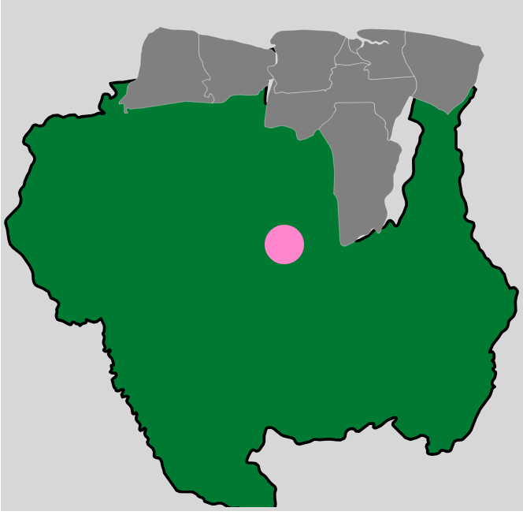

# Welkom bij mijn Productbiografie

## Sprint 0

### Mijn leerdoelen
- Ik wil graag meer leren over **CSS** en mezelf hierin verder ontwikkelen. Animaties vind ik erg leuk en interessant, en ik wil ze beter onder de knie krijgen. Uiteindelijk wil ik functionele websites kunnen maken die niet alleen fijn aanvoelen voor mij, maar ook voor de mensen die ze gebruiken.  
- Ik wil **JavaScript** zo goed mogelijk leren, zodat ik de code beter kan begrijpen en schrijven. Ik wil me er verder in verdiepen, want op dit moment beheers ik alleen de basis en nog niet de details.  
- Ik wil beter leren samenwerken binnen een team op het gebied van **coderen**, omdat ik binnenkort stage ga lopen als front-end developer en deze vaardigheden goed van pas zullen komen.

### Daily check out 04/02/2026

Wat heb ik vandaag gedaan? 
ik heb vandaag de workshop gevolgd over API, hoe je deze kan halen uit een database, in dit geval mijn informatie. daarnaast heb ik gewerkt aan mijn eigen bestand/website, ik heb de path van mijn svg laten werken. Want in eerste instantie ging hij draaien op de hele website toen ik :hover erovr plaatste en een animatie. Vervolgens heb ik de weekly gesprek gevolgd van Kilian Valkhof.

Hoeveel tijd heeft me dat gekost? Dit heeft me ongeveer 3 uren gekost, om mijn svg werkend te laten maken.

Wat heb ik geleerd? ik heb meer geleerd hoe ik api uit een database kan halen, en hoe ik het kan laten werken op mijn website.

Wat ga ik morgen doen? Morgen ga ik me website beter laten werken, door de website paths klikbaar te maken, zodat ik informatie aan de rechterkant krijg.

### Daily check out 05/02/2026

Wat heb ik vandaag gedaan? 
ik heb vandaag de workshop gevolgd over HTML, dus hoe ik beter kan leren werken met forms etc. Wat ik heb geleerd is, hoe ik een form beter kan schrijven in html met descrption list. Ook wat er hoort in de head en hoe alles zo'n beetje werkt. Vervolgens heb ik me website klikbaar gemaakt. dus als er op een district word geklikt wijst het meer info beneden.

Hoeveel tijd heeft me dat gekost? Dit heeft me ongeveer 4 uren gekost, om mijn svg klikbaar te laten maken.

Wat heb ik geleerd? ik heb meer geleerd hoe ik me website klikbaar kan maken, dus de svg zelf. En hoe ik beter forms kan maken.

Wat ga ik morgen doen? Morgen ga ik me website beter laten werken, door de website paths klikbaar te maken, zodat ik informatie aan de rechterkant krijg.text aanpassen, de text laten werken. en met api mijn info laten zien op de desbetreffende knop die gedrukt word.
bronnen: 

### Daily check out 06/02/2026

Wat heb ik vandaag gedaan? 
ik heb vandaag mijn werk laten zien door deel te nemen aan de minoren markt, daarna ben ik gaan werken aan mijn eigen website. Ik heb ook nog een section gezet in me html om gegevens in te laden vanuit de api voor studenten gegevens.

Hoeveel tijd heeft me dat gekost? Dit heeft me ongeveer 1-2 uren gekost, want na mijn minoren markt was ik niet heel lang gebleven.

Wat heb ik geleerd? ik heb geleerd dat ik lege ul etc mag zetten in me html code en deze later aanvullen met de gegevens die ik ophaal.

## Weekly Check week 1
Deze week stond vooral in het teken van leren werken met API’s, interactieve SVG’s en beter structureren van HTML. Ik heb verschillende workshops gevolgd en deze kennis direct toegepast binnen mijn eigen project.
Wat heb ik gedaan?


Ik heb een API-workshop gevolgd en geleerd hoe ik data kan ophalen uit een database om te gebruiken op mijn eigen website.


In mijn project heb ik mijn SVG verbeterd, zodat de paden correct reageren op hover-animaties.


Daarna heb ik mijn SVG klikbaar gemaakt, zodat bij het aanklikken van een onderdeel extra informatie wordt getoond.


Tijdens de workshop over HTML heb ik geleerd hoe ik beter kan werken met forms en description lists, en hoe ik informatie logisch opbouw in de head en body.


Op vrijdag heb ik deelgenomen aan de minorenmarkt, waarna ik gewerkt heb aan het inladen van mij naam via een API in mijn HTML-structuur.


Wat heb ik geleerd?


Hoe ik API-data kan ophalen en toepassen in mijn project.

```async function tekstInvoegen() {
    const URL = "https://fdnd.directus.app/items/person/309"
    let response = await fetch(URL)
    let gegevensPersonen = await response.json()
    titel.textContent = gegevensPersonen.data.name
}
```


Hoe ik een interactieve SVG maak met klikbare paden en animaties.


Dat ik in HTML alvast lege elementen (zoals een ul) mag neerzetten en deze later met data kan vullen via JavaScript.


Een beter begrip gekregen van hoe forms en semantische HTML zijn opgebouwd.


Reflectie
Deze week heb ik veel geleerd over hoe front-end code samenwerkt tussen HTML, CSS en JavaScript. Vooral het klikbaar maken van mijn SVG voelde als een belangrijke stap vooruit, omdat ik nu echt dynamische interacties kan bouwen. Voor volgende week wil ik mijn focus leggen op het laten tonen van API-data op de juiste plek binnen mijn site en de vormgeving verder verbeteren.


### Daily check out 09/02/2026
Wat heb ik vandaag gedaan? 
ik heb vandaag de workshop gevolgd over fetchen en filtering en sorting van Sanna. Hierna ben ik aan de slag gegaan met me website. ik heb me gegevens ingevuld in me webswite, dus als je op een district klik geef hij steeds ander info. Daarna probeerde ik mijn svg een video als background te geven met de rand van de svg. dat lukte mij niet.

Hoeveel tijd heeft me dat gekost? de workshop was ongeveer 1.3 uur gekost. en aan me website zelf ongeveer 3-4 uren.

Wat heb ik geleerd? ik heb meer geleerd over hoe ik de fetch and sorting en filtering beter kan doen, en hoe ik dit kan gebruiken om gegevens op te halen van studenten voor mijn eigen website.

Wat ga ik morgen doen? Morgen ga ik me website compleet maken qua info in me text, en het ook stijl geven, en me dark and light mode toevoegen.

bronnen;
https://secure.kwaliteitsregisterparamedici.nl/lists/nieuws/artikel.aspx?Id=171&Source=/nieuws
https://nl.vecteezy.com/video/10248662-republiek-van-suriname-realistische-zwaaiende-vlag-gladde-naadloze-loop-4k-video
https://www.google.com/imgres?q=music&imgurl=https%3A%2F%2Fwww.pianoemporium.com%2Fwp-content%2Fuploads%2F2019%2F03%2Fmusic-keyboard-technology-guitar-concert-piano-1108329-pxhere.com_-800x600.jpg&imgrefurl=https%3A%2F%2Fwww.pianoemporium.com%2F7-free-music-theory-websites-we-recommend%2F&docid=Tl1hb8mozsApWM&tbnid=OI7esvu4obO9NM&vet=12ahUKEwigj_2YrcySAxXkYEEAHRwjKwcQnPAOegQISBAB..i&w=800&h=600&hcb=2&ved=2ahUKEwigj_2YrcySAxXkYEEAHRwjKwcQnPAOegQISBAB

### Daily check out 10/02/2026
Wat heb ik vandaag gedaan? 
ik heb vandaag de workshop gevolgd over typografie, ik heb een en ander geleerd over de regels van typografie en waarop ik moet letten. daanra werd er verteld over masking. dit had ik namelijk gevraagd want ik wou het in me website doen. dus vasilis wees ons hoe dat moet en ik heb dat nagekeken. ook heb ik me font gezocht en die in me website gezet. Ik heb ook mijn dark and light mode toegevoegd.

Hoeveel tijd heeft me dat gekost? de workshop was ongeveer 1 uurtje, daarna zat ik ongeveer 3 uren aan mijn eigen werk. ik heb me masking kunnen toevoegen op mijn website.

Wat heb ik geleerd? ik heb meer geleerd over de regels van typografie en hoe ik masking kan gebruiken binnen me website. Ook hoe ik de math random kan gebruiken om een random persoon te halen uit een api en die in me website te laten verschijnen (het was een opfrisser). Ook heb ik de Masking geleerd.

Wat ga ik morgen doen? Morgen ga ik me website compleet maken mbt details, en kijken als ik aan alle eisen heb voldaan.

bronnen;
- https://tenor.com/view/suriname-flag-gif-south-america-gif-27458138 
- https://developer.mozilla.org/en-US/docs/Web/CSS/Reference/Properties/-webkit-text-stroke
- https://fonts.google.com/selection/embed
- https://codepen.io/pierrinho/pen/NEYmLO

### Daily check out 10/02/2026
Wat heb ik vandaag gedaan? 
ik heb vandaag mijn website afgemaakt en me eisen gecheckt, dus als ik aan allemaal voldoet. Daarnaast heb ik wat details toegevoegd. mijn cursor is nu een cirkel met inverted kleur. En me foto's laten springen. Ook heb ik me code review gedaan en gecheckt als ik aan alles voldoet. 

Hoeveel tijd heeft me dat gekost? Het heeft me ongveer 4 uren gekost.

Wat heb ik geleerd? ik heb geleerd hoe ik me cursor kan veranderen, en waarop ik moet letten tijdens de code review en hoe.

Wat ga ik morgen doen? Morgen ga ik me website code etc bespreken met een groepje en daarna deelnemen aan de kleine markt om te laten zien wat ik heb.

bronnen;
- https://dev.to/mattmarquise/how-to-create-a-custom-circular-cursor-for-your-website-4i7p

## Weekly Week 2
Deze week stond in het teken van het verder uitbouwen en afronden van mijn website, met nieuwe technieken zoals fetching, filtering, sorting, masking en het toevoegen van dark & light mode. Ik heb  geëxperimenteerd met animaties, CSS-effecten en de presentatie van informatie via API’s.

Wat heb ik gedaan?

Maandag heb ik de workshop gevolgd over fetching, filtering en sorting. Daarna heb ik API-gegevens op mijn website ingevuld, zodat bij het klikken op een district steeds andere informatie verschijnt. Ik heb ook geprobeerd een video te gebruiken als background in mijn SVG, maar dat lukte nog niet volledig.


Dinsdag volgde ik een workshop over typografie, waarin ik leerde over leesbaarheid, contrast en lay-out. Daarna werkte ik aan CSS masking (met hulp van Vasilis) en heb ik mijn dark & light mode toegevoegd.


Woensdag heb ik mijn website afgerond, details toegevoegd (zoals een custom cursor en animaties bij foto’s) en mijn code review gedaan om te controleren of ik aan alle eisen voldoe.


Wat heb ik geleerd?


Hoe ik de fetch, sort en filter methodes kan gebruiken om gegevens dynamisch te laden op mijn website.
```
async function loadOneStudent(url) {
    let response = await fetch(url)
    let responseJSON = await response.json()
    let deMinorMensen = responseJSON.data
    console.log(deMinorMensen)

    if (deMinorMensen.length > 0) {
        let randomPersoon = Math.floor(Math.random() * deMinorMensen.length)
        let eenMinorMens = deMinorMensen[randomPersoon]
        console.log(eenMinorMens)

        if (eenMinorMens.avatar === null || eenMinorMens.avatar === undefined) {
            eenMinorMens.avatar = "https://www.thetombomb.com/images/ForPosts/null.png"
        }

        let minorMensenHTML = `
        <li>
            <h3>${eenMinorMens.name}</h3>
            
        </li>`
        infoUL.insertAdjacentHTML("beforeend", minorMensenHTML)
    }
}

```


Hoe ik masking kan toepassen in CSS om beeld en tekst te combineren.
```
@supports (background-clip:text) or (-webkit-background-clip:text) {
        color: transparent;
        -webkit-background-clip: text;
        background-image: url(https://media1.tenor.com/m/-8jBbL3jwAEAAAAd/suriname-flag-gif.gif);
        background-size: 10% auto;
        background-position: center;
    }
```

Meer kennis over typografie-regels en hoe fonts het gevoel van een website beïnvloeden.


Praktische ervaring opgedaan met dark & light modes, custom cursors en animatie-effecten.
```
:root {

    --h1-color: black;
    --h2-color: black;
    --pcolor: #2d2d2d;
    --background-color: #d7d7d7;
    --section-color: antiquewhite;
    --stroke-color: black;
    --stroke-color-h1: transparent;
}

@media (prefers-color-scheme: dark) {
    :root {
        --h1-color: white;
        --h2-color: white;
        --pcolor: white;
        --background-color: #424242;
        --section-color: black;
        --stroke-color: white;
        --stroke-color-h1: white;
    }
}

```

Hoe ik kritisch mijn eigen code kan beoordelen tijdens een code review.


Reflectie
Deze week voelde als een afrondende fase waarin ik alles wat ik de vorige weken heb geleerd samenbracht in één werkend product. Vooral het toevoegen van dark/light mode en masking gaf mijn website een professionele uitstraling. Ik merk dat ik meer controle krijg over hoe ik design en code samen laat komen.